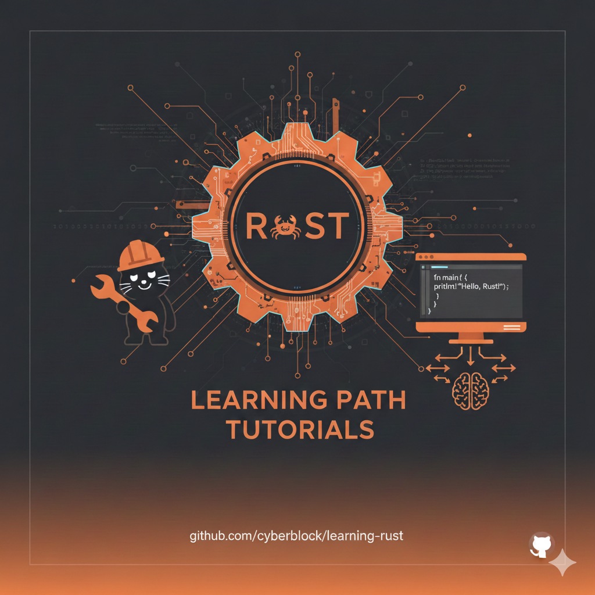

# Tutoriales Rust (Guía de Aprendizaje)



Ruta de pasos para aprender Rust apoyándote en el
[curso de Rust de Píldoras Informáticas](https://www.youtube.com/playlist?list=PLU8oAlHdN5BmhyZZQN0IyYUgimevrPL-i)
(canal: https://www.youtube.com/@pildorasinformaticas). Los vídeos sirven de refuerzo conceptual; este
repositorio reúne **apuntes propios**, el **código de cada vídeo** y **ejercicios con soluciones**.

## Objetivos
- Aprender los fundamentos de Rust de forma incremental.
- Practicar cada concepto con ejercicios breves.
- Adoptar buenas prácticas (ownership, borrowing, errores, concurrencia segura).

---

## Estructura del repositorio

```
learning-rust/
├── Cargo.toml                  # workspace: agrupa todos los proyectos
├── Rust (Guía de Aprendizaje).md
├── apuntes/                    # un apunte .md por vídeo + índice (README.md)
├── 02_hola_rust/               # un proyecto de Cargo por vídeo
│   ├── src/main.rs             #   código del vídeo (ejecutable)
│   └── examples/
│       ├── ejercicios_02.rs    #   enunciados + todo!() para que los resuelvas
│       └── soluciones_02.rs    #   soluciones
├── 03_estructura_y_tipos/
├── ...
└── 17_hashmap_entry/
```

## Cómo usar este repositorio

Desde la **raíz** del repositorio (el nombre del paquete es el de la carpeta sin el número):

```bash
cargo run -p borrowing                            # ejecuta el código del vídeo 06
cargo run -p borrowing --example ejercicios_06    # tus ejercicios (fallan con todo!() hasta que los resuelvas)
cargo run -p borrowing --example soluciones_06    # las soluciones
cargo build                                       # compila TODOS los proyectos
```

O entrando en la carpeta, como siempre:

```bash
cd 06_borrowing
cargo run
cargo run --example ejercicios_06
```

**Método de estudio recomendado para cada vídeo:**
1. Mira el vídeo.
2. Lee el apunte en `apuntes/` (resumen, conceptos y errores típicos).
3. Ejecuta y modifica `src/main.rs`: descomenta las líneas marcadas con ❌ para ver el error del compilador.
4. Resuelve `examples/ejercicios_XX.rs` sustituyendo cada `todo!()`.
5. Compara con `examples/soluciones_XX.rs`.

---

## Progreso del curso

| Vídeo | Tema | Carpeta | Apuntes |
|:-----:|------|---------|---------|
| 01 | Temario y presentación | — | [01](apuntes/01-temario-y-presentacion.md) |
| 02 | Características e instalación | [02_hola_rust](02_hola_rust/src/main.rs) | [02](apuntes/02-caracteristicas-e-instalacion.md) |
| 03 | Estructura de proyecto y tipos | [03_estructura_y_tipos](03_estructura_y_tipos/src/main.rs) | [03](apuntes/03-estructura-proyecto-y-tipos.md) |
| 04 | Variables y binding | [04_variables_binding](04_variables_binding/src/main.rs) | [04](apuntes/04-declaracion-de-variables-binding.md) |
| 05 | Mutables vs constantes | [05_mutables_constantes](05_mutables_constantes/src/main.rs) | [05](apuntes/05-inmutables-mutables-constantes.md) |
| 06 | Borrowing | [06_borrowing](06_borrowing/src/main.rs) | [06](apuntes/06-borrowing.md) |
| 07 | Lifetimes. `String` vs `&str` | [07_lifetimes_string_str](07_lifetimes_string_str/src/main.rs) | [07](apuntes/07-lifetimes-string-vs-str.md) |
| 08 | Slices | [08_slices](08_slices/src/main.rs) | [08](apuntes/08-slices.md) |
| 09 | Vectores I: creación | [09_vectores_creacion](09_vectores_creacion/src/main.rs) | [09](apuntes/09-vectores-I-creacion.md) |
| 10 | Vectores II: eliminar y acceder | [10_vectores_acceso](10_vectores_acceso/src/main.rs) | [10](apuntes/10-vectores-II-eliminar-y-acceder.md) |
| 11 | Vectores III: bucle `for` | [11_vectores_for](11_vectores_for/src/main.rs) | [11](apuntes/11-vectores-III-bucle-for.md) |
| 12 | Vectores IV: iteradores | [12_iteradores](12_iteradores/src/main.rs) | [12](apuntes/12-vectores-IV-iteradores.md) |
| 13 | `map`, `filter`, `collect` | [13_map_filter_collect](13_map_filter_collect/src/main.rs) | [13](apuntes/13-iteradores-map-filter-collect.md) |
| 14 | Funciones de cálculo | [14_funciones_calculo](14_funciones_calculo/src/main.rs) | [14](apuntes/14-iteradores-funciones-de-calculo.md) |
| 15 | Ejemplo práctico: notas | [15_ejemplo_notas](15_ejemplo_notas/src/main.rs) | [15](apuntes/15-ejemplo-practico-notas.md) |
| 16 | HashMap I | [16_hashmap](16_hashmap/src/main.rs) | [16](apuntes/16-hashmap-I.md) |
| 17 | HashMap II: claves duplicadas | [17_hashmap_entry](17_hashmap_entry/src/main.rs) | [17](apuntes/17-hashmap-II-claves-duplicadas.md) |

**Leyenda de la ruta:** ✅ cubierto en el curso · 🟡 cubierto en parte · ⏳ pendiente (próximos vídeos)

---

## Ruta de Aprendizaje

### 1. Preparación ✅
📺 Vídeos 02–03 · 📁 `02_hola_rust`, `03_estructura_y_tipos`

- Instalar `rustup` (https://rustup.rs).
- Verificar: `rustc --version`, `cargo --version`.
- Crear el primer proyecto: `cargo new hola_rust`.
- Estructura de un proyecto: `src/main.rs`, `Cargo.toml`, `.gitignore`, `target/`.
- Windows: si falla al generar el ejecutable, cambia al *toolchain* GNU (ver apunte 03).

Ejercicio: imprime "Hola Rust", compila con `cargo build` y ejecuta con `cargo run`. → `ejercicios_02.rs`

### 2. Fundamentos Sintácticos ✅
📺 Vídeos 03–05 · 📁 `03_estructura_y_tipos`, `04_variables_binding`, `05_mutables_constantes`

Temas: `fn main`, comentarios, `let`, mutabilidad (`mut`), constantes (`const`), tipos primitivos
(enteros, decimales, `bool`, `char`), tuplas y arrays, inferencia de tipos, macros (`println!`).

Ejercicio: declara variables con y sin `mut`, e imprime valores compuestos usando debug `{:?}`.
→ `ejercicios_03.rs`, `ejercicios_04.rs`, `ejercicios_05.rs`

### 3. Control de Flujo 🟡
📺 Vídeos 11, 13 (se usan `for` e `if`; `loop`, `while` y `match` llegarán más adelante)

Temas: `if`, `else if`, `loop`, `while`, `for`, rangos (`1..10`, `1..=10`).

Ejercicio: tabla de multiplicar (1..=10) con `for`. → `ejercicios_09.rs` (3) y `ejercicios_11.rs` (4)

### 4. Propiedad (Ownership) ✅
📺 Vídeos 04, 07 · 📁 `04_variables_binding`, `07_lifetimes_string_str`

Conceptos: *binding*, movimiento (*move*), `Copy` vs `clone()`, stack vs heap, `String` vs `&str`.

Ejercicio: escribe funciones que consumen `String` y otras que reciben `&str`. Observa qué compila.
→ `ejercicios_04.rs` (2 y 3), `ejercicios_07.rs`

### 5. Préstamos (Borrowing) y Referencias ✅
📺 Vídeo 06 · 📁 `06_borrowing`

Temas: `&T`, `&mut T`, reglas de préstamos, el préstamo vive hasta su último uso.

Ejercicio: función que calcula la longitud (o las vocales) de una cadena sin mover la propiedad.
→ `ejercicios_06.rs`

### 6. Slices ✅
📺 Vídeo 08 · 📁 `08_slices`

Temas: `&str`, slices de arrays (`&[T]`), rangos, *fat pointers* (puntero + longitud), `Display` vs `Debug`.

Ejercicio: función que devuelve la primera palabra de una frase usando un slice sobre `&str`.
→ `ejercicios_08.rs` (2)

### 7. Structs e Impl ⏳
Temas: definición, métodos (`impl`), `#[derive(Debug)]`.

Ejercicio: struct `Usuario { id: u32, nombre: String }` con el método `fn nombre_mayus(&self)`.

### 8. Enums y Pattern Matching ⏳
Temas: `enum`, `match`, `if let`. (Adelanto de `match` e `if let` con `Option` en `10_vectores_acceso`).

Ejercicio: enum `ResultadoRed { Ok(u16), Error(String) }` y una función que imprima distinto según el caso.

### 9. Option y Result 🟡
📺 Vídeos 10, 14, 15 (`Option`, `Some`, `None`, `unwrap`) · `Result` y `?` pendientes

Temas: manejo seguro de la ausencia de valor (Rust no tiene `null`), propagación de errores (`?`).

Ejercicio: función que lee un número desde un `String` y devuelve `Result<u32, String>`.
→ ya puedes practicar `Option` con `ejercicios_10.rs` (3)

### 10. Módulos y Organización ⏳
Temas: `mod`, `pub`, estructura en carpetas, `lib.rs`, workspaces (este repo ya es uno).

Ejercicio: separa la lógica de parseo en un `mod parser`.

### 11. Genéricos y Traits 🟡
📺 Vídeos 08, 15 (qué es un trait: `Display`, `Debug`, `Ord`) · genéricos pendientes

Temas: parámetros genéricos, `trait`, `impl<T>`.

Ejercicio: trait `Resumen` con el método `resumen()`, implementado para dos structs.

### 12. Lifetimes (Intro) ✅
📺 Vídeo 07 · 📁 `07_lifetimes_string_str`

Temas: duración de referencias, *Non-Lexical Lifetimes*, sintaxis mínima de anotación `'a`.

Ejercicio: función que devuelve la referencia más larga entre dos `&str`. → `ejercicios_07.rs` (3)

### 13. Colecciones Estándar ✅
📺 Vídeos 09–11, 16–17 · 📁 `09_…` a `11_…`, `16_hashmap`, `17_hashmap_entry`

Temas: `Vec` (`push`, `pop`, `get`, `len`, `capacity`), `HashMap` (`insert`, `get`, `entry().or_insert()`), `String`.

Ejercicio: contar la frecuencia de palabras en una frase usando `HashMap`. → `ejercicios_17.rs` (2)

### 14. Iteradores y Cierres ✅
📺 Vídeos 12–15 · 📁 `12_iteradores` a `15_ejemplo_notas`

Temas: `iter()`, `iter_mut()`, `into_iter()`, `map`, `filter`, `collect`, `sum`, `find`, `count`,
`any`, `all`, `max`/`min`, `max_by` + `partial_cmp`, closures.

Ejercicio: filtrar los números pares y elevarlos al cuadrado. → `ejercicios_13.rs` (1)

### 15. Concurrencia ⏳
Temas: `std::thread`, `move`, `join`, `Mutex`, `Arc`.

Ejercicio: contador compartido incrementado por varios hilos.

### 16. Errores Personalizados ⏳
Temas: `thiserror` (opcional), enum de errores, `From`.

Ejercicio: enum `AppError` para errores de IO y de parseo.

### 17. Macros (Vista Inicial) 🟡
📺 Vídeo 03 (qué es una macro: genera código al compilar) · `macro_rules!` pendiente

Temas: diferencia entre `macro_rules!` y funciones.

Ejercicio: macro simple que envuelva `println!` con el prefijo `[DEBUG]`.

### 18. Cargo y Publicación 🟡
📺 Vídeos 02–03 (`cargo new`, `run`, `build`, `clean`, `Cargo.toml`)

Temas: `Cargo.toml`, *features*, *workspaces*, `cargo fmt`, `cargo clippy`.

Ejercicio: ejecuta `cargo clippy` en el workspace y corrige los avisos (este repo ya pasa sin avisos).

### 19. Testing ⏳
Temas: tests unitarios, de integración, `#[should_panic]`.

Ejercicio: test para una función de parseo y otro que verifique el error.

### 20. Proyecto Final ⏳
Construir una mini CLI: lectura de archivo, conteo de líneas y búsqueda de un patrón.

---

## Ejercicios Extra
- ✅ Simular una caja registradora con `HashMap<String, f32>`. → `ejercicios_16.rs` (4)
- ✅ Calificar notas (Suspenso/Aprobado/Notable/Sobresaliente) con `map`. → `ejercicios_15.rs` (4)
- Implementar `FizzBuzz` genérico sobre cualquier tipo que implemente `Display`.
- Parser simple para una mini expresión matemática (suma y multiplicación).

## Chuleta de Cargo

| Comando | Qué hace |
|---------|----------|
| `cargo new <nombre>` | Crea un proyecto nuevo |
| `cargo run` | Compila y ejecuta |
| `cargo build` | Solo compila (`target/debug/`) |
| `cargo build --release` | Compila optimizado (`target/release/`) |
| `cargo check` | Comprueba errores sin generar el ejecutable (más rápido) |
| `cargo clean` | Borra `target/` (útil si un archivo queda bloqueado) |
| `cargo run --example <nombre>` | Ejecuta un archivo de `examples/` |
| `cargo fmt` | Formatea el código |
| `cargo clippy` | Revisa el código y sugiere mejoras |
| `cargo doc --open` | Genera y abre la documentación |

## Buenas Prácticas
- Usa `cargo fmt` y `cargo clippy` con regularidad.
- Lee los errores del compilador completos: casi siempre explican el problema y proponen la solución.
- Para solo **leer** datos, recibe préstamos (`&str`, `&[T]`) en lugar de `&String` o `&Vec<T>`.
- Prefiere `get()` (devuelve `Option`) a los corchetes `v[i]` cuando el índice puede no existir.
- Usa `unwrap()` solo cuando estés seguro de que hay valor; en librerías, prefiere `Result` a `panic!`.
- Documenta con `///` y genera la documentación con `cargo doc --open`.

## Recursos Complementarios
- The Rust Book (oficial): https://doc.rust-lang.org/book/ · en español: https://book.rustlang-es.org/
- Rust by Example: https://doc.rust-lang.org/rust-by-example/
- Rustlings (ejercicios guiados): https://github.com/rust-lang/rustlings
- Exercism, pista de Rust: https://exercism.org/tracks/rust
- Documentación de la librería estándar: https://doc.rust-lang.org/std/
- Playground: https://play.rust-lang.org

## Créditos
- **Autor del curso:** Juan, de [Píldoras Informáticas](https://www.pildorasinformaticas.es)
- **Canal de YouTube:** [@pildorasinformaticas](https://www.youtube.com/@pildorasinformaticas)
- **Lista original:** [Curso Rust](https://www.youtube.com/playlist?list=PLU8oAlHdN5BmhyZZQN0IyYUgimevrPL-i)

> Este repositorio contiene apuntes de estudio propios basados en su curso. No tiene relación oficial
> con el autor ni con el canal. Los vídeos no se incluyen en el repositorio: se enlazan desde cada apunte.
